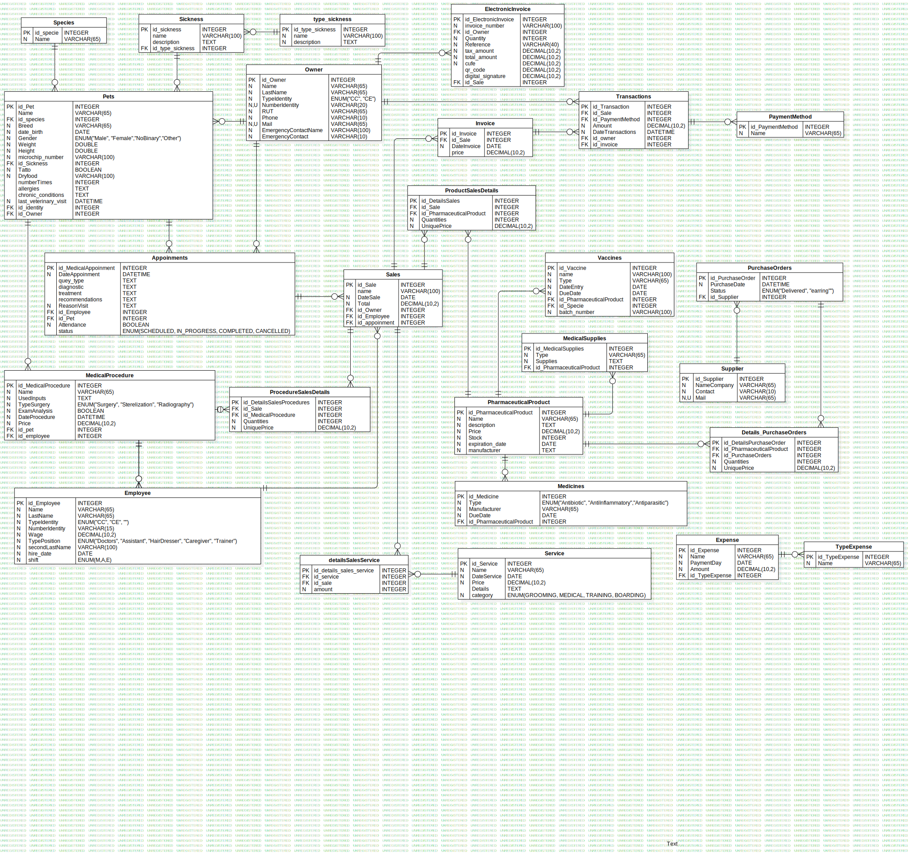

# My Little Pet Shop Vet

This project is a system that allows you to efficiently manage the operations of a veterinary clinic. The system is designed to manage information about pets, their owners, health history, inventory of medications and vaccines, scheduling of medical consultations and procedures, as well as billing and additional services.


## Table of Contents 

| Index | Title |
| ------ | --------------- |
| 1. | Project Description |
| 2. | System Requirements |
| 3. | Installation |
| 4. | Database Image|
| 5. | Class Diagram |
| 6. | Main Features|
| 7. | Contributions|
| 8. | FAQs |
| 9. | License |
| 10. | Contact |

## System Requirements

List of technologies used in the project:
- **MySQL** (version 5.7 or higher): Open source relational database management system, used for the creation, administration and query of the database. It is necessary to install MySQL on the system to run the SQL scripts and manage the database structure efficiently.

- **MySQL Workbench** (version 8.0 or higher): Graphical administration and development tool for MySQL, which allows you to design, manage and execute SQL queries, as well as view the database in a more interactive way.

- **Java** (version 17): The Java programming language is used across platforms and devices, due to its easily transferable code. 

## Installation

Clone the project

```bash
  git clone https://github.com/Stefanyyy15/MyLittlePetShop_Michelle_Yuli.git
```

Go to the project directory

```bash
  cd MyLittlePetShop_Michelle_Yuli.git
```

Go to file

```bash
  code .
```

## Database Image



## Class Diagrama

- Aqui se supone q va

## Main Features

### Main Menu

- **Owner & Pet:** Manage pet owners and their pets.

- **Pharmaceutical Product:** Manage pharmaceutical products, vaccines, and medicines.

- **Medical Procedure & Service:** Record and control medical procedures and services.

- **Supplier & Inventory:** Manage suppliers and inventory.

- **Agenda:** Control appointments and schedules (not yet implemented).

- **Invoice:** Generate and manage invoices.

- **Report & Analysis:** Generate reports and perform analysis (not yet implemented).

- **Special Activities:** Manage special activities.

### Owner and Pet Management

- **Register Owner:** Add a new owner to the system.

- **List Owners:** View the list of all registered owners.

- **Edit Owner:** Update information about an existing owner.

- **Delete Owner:** Remove an owner from the system.

- **Register Pet:** Add a new pet associated with an owner.

- **List Pets:** View the list of all registered pets.

- **Edit Pet:** Update information about a pet.

- **Delete Pet:** Remove a pet from the system.

### Pharmaceutical Product Management

- **Register Pharmaceutical Product:** Add new pharmaceutical products to the inventory.

- **List Pharmaceutical Products:** View all available pharmaceutical products.

- **Edit Pharmaceutical Product:** Update the details of a product.

- **Delete Pharmaceutical Product:** Remove a product from the inventory.

- **Register Vaccine:** Add new vaccines to the system.

- **List Vaccines:** View available vaccines.

- **Edit Vaccine:** Update vaccine information.

- **Delete Vaccine:** Remove a vaccine from the system.

### Medical Procedures and Services Management

- **Register Medical Procedure:** Add available medical procedures.

- **List Medical Procedures:** View all registered procedures.

- **Edit Medical Procedure:** Update details of a procedure.

- **Delete Medical Procedure:** Remove a procedure from the system.

- **Register Service:** Add additional services.

- **List Services:** View all available services.

- **Edit Service:** Update details of a service.

- **Delete Service:** Remove a service from the system.

### Supplier and Inventory Management

- **Register Supplier:** Add new suppliers.

- **List Suppliers:** View the list of registered suppliers.

- **Edit Supplier:** Update supplier information.

- **Delete Supplier:** Remove a supplier.

- **Register Inventory Product:** Add products to the inventory.

- **List Inventory Products:** View stored products.

- **Edit Inventory Product:** Update details of an inventory product.

- **Delete Inventory Product:** Remove products from the inventory.

### Special Activities

- **Register Special Activity:** Create a new special activity.

- **List Special Activities:** View registered special activities.

- **Edit Special Activity:** Update information about a special activity.

- **Delete Special Activity:** Remove a special activity.

## Contributions

| Type of contribution | Name | Comments |
|:---------------------|:--------:|------------:|
| Teamwork | Both | We organize ourselves and distribute tasks efficiently and effectively.|
| Help | Both | We support each other when we encounter obstacles or blocks. |
| Diagram | Daniel | Created the diagram quickly, clearly and consistent with the requirements.|
| Readme | Stefany |I wrote the README according to the instructions, ensuring its clarity. |


## License

This project is licensed under the MIT License. 

[](https://choosealicense.com/licenses/mit/)


## Contact

If you have any questions or would like more information, do not hesitate to contact us:

- **Name**: Michelle
- **GitHub**: [https://github.com/miDaya02](https://github.com/miDaya02)

- **Name**: Stefany
- **GitHub**: [https://github.com/Stefanyyy15](https://github.com/Stefanyyy15)

---